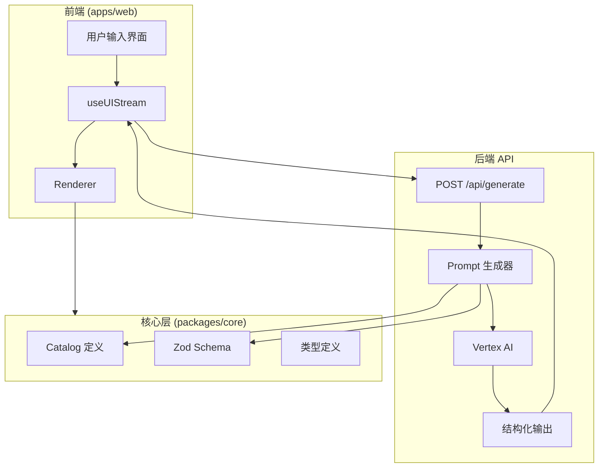

# Architecture

## Overview

改进后的 AI UI 生成架构：



## Components

### 1. 后端 API (`apps/web/app/api/generate/route.ts`)

#### 职责
- 接收用户请求
- 生成 system prompt
- 调用 AI 模型
- 返回结构化输出

#### 改动点
```typescript
// 之前：JSONL 流式
const result = streamText({
  model: vertex(model),
  system: generateSystemPrompt(),
  prompt: sanitizedPrompt,
});

return result.toTextStreamResponse();

// 之后：结构化输出
import { Output } from "ai";

const result = streamText({
  model: vertex(model),
  system: generateSystemPrompt(),
  prompt: sanitizedPrompt,
  output: Output.object({
    schema: demoCatalog.treeSchema,
  }),
});

return result.toTextStreamResponse();
```

### 2. Prompt 生成器

#### 职责
- 组装系统提示
- 包含组件目录
- 包含布局模式
- 包含示例

#### 新增文件
```
apps/web/lib/
├── catalog.ts          # 增强的组件目录
├── layoutPatterns.ts   # 布局模式定义
└── promptTemplates.ts  # Prompt 模板
```

### 3. 前端 Hook (`packages/react/src/hooks.ts`)

#### 职责
- 发送请求到 API
- 处理响应
- 管理 UI 树状态

#### 改动点
```typescript
// 新增模式参数
interface UseUIStreamOptions {
  api: string;
  mode: "patch" | "full";  // 新增
  onComplete?: (tree: UITree) => void;
  onError?: (error: Error) => void;
}

// 处理完整 JSON 模式
async function handleFullJson(response: Response) {
  const text = await response.text();
  try {
    return JSON.parse(text) as UITree;
  } catch {
    // 尝试流式解析
    return parsePartialJson(text);
  }
}
```

### 4. Catalog (`packages/core/src/catalog.ts`)

#### 职责
- 定义可用组件
- 生成组件提示
- 验证输出

#### 现有功能（复用）
- `createCatalog()` - 创建目录
- `generateCatalogPrompt()` - 生成提示
- `validateTree()` - 验证树
- `validateElement()` - 验证元素

### 5. 渲染器 (`packages/react/src/renderer.tsx`)

#### 职责
- 渲染 UI 树
- 递归渲染子元素

#### 无需改动
现有渲染器已经支持 UITree，直接复用。

## Data Flow

### 完整 JSON 模式

```
1. 用户输入 prompt
2. useUIStream 发送 POST 请求
3. 后端生成 system prompt (包含 catalog + patterns)
4. 调用 Vertex AI，使用 output: "json" 约束
5. AI 返回完整 JSON
6. 前端接收完整 JSON
7. 解析为 UITree
8. 调用 Renderer 渲染
9. 显示 UI
```

### 渐进式渲染（可选）

```
1-5. 同上
6. AI 开始流式输出
7. 前端累积接收片段
8. 尝试解析完整 JSON
  - 成功 → 渲染完整 UI
  - 失败 → 继续等待
9. 最终渲染
```

## File Changes Summary

### 新增文件

| 文件 | 描述 |
|------|------|
| `apps/web/lib/layoutPatterns.ts` | AR 布局模式定义 |
| `apps/web/lib/promptTemplates.ts` | Prompt 模板 |

### 修改文件

| 文件 | 改动 |
|------|------|
| `apps/web/app/api/generate/route.ts` | 使用结构化输出 |
| `apps/web/lib/catalog.ts` | 增强组件描述 |
| `packages/react/src/hooks.ts` | 支持完整 JSON 模式 |

### 复用文件

| 文件 | 复用方式 |
|------|----------|
| `packages/core/src/catalog.ts` | 完全复用 |
| `packages/core/src/types.ts` | 完全复用 |
| `packages/react/src/renderer.tsx` | 完全复用 |

## Error Handling

### 层级 1: API 请求错误
```typescript
try {
  const response = await fetch(api, { ... });
  if (!response.ok) {
    throw new Error(`HTTP ${response.status}`);
  }
} catch (err) {
  setError(err);
}
```

### 层级 2: JSON 解析错误
```typescript
try {
  tree = JSON.parse(text);
} catch {
  // 尝试流式解析
  tree = parsePartialJson(text);
  if (!tree) {
    throw new Error("Invalid JSON response");
  }
}
```

### 层级 3: Schema 验证错误
```typescript
const result = catalog.validateTree(tree);
if (!result.success) {
  console.error("Validation errors:", result.error);
  // 使用默认值或错误状态
}
```

### 层级 4: 渲染错误
```typescript
// 渲染器已有 fallback 组件
<Renderer tree={tree} registry={registry} fallback={Fallback} />
```
